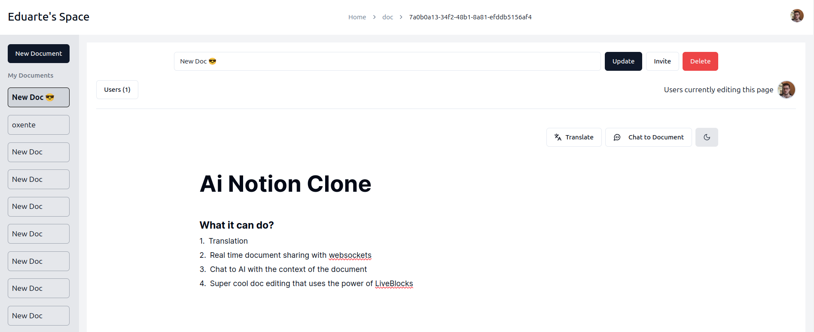

# AI Notion Clone

Ai Notion Clone is a project that integrate a lot of technologies and capabilities together. It range from Open AI integration to realtime document sharing, authentication and translation.



## Table of Contents

- [Features](#features)
- [How It Works](#how-it-works)
- [Installation](#installation)
- [Tech Stack](#tech-stack)
- [Contributing](#contributing)
- [Repositories](#project-repositories)
- [License](#license)

## Features

- Translation
- Chat to Document with GPT
- Invite people to work with your document using an email
- Realtime document leveraging LiveBlocks and yjs
- Authentication
- Light and Dark mode

## How It Works

This project works by integrating LiveBlocks, Postgres Database, User Authentication, Cloudflare Workers, Open API together

LiveBlocks is responsible for the document itself, it provides the realtime document and a super nice UX, for each document a uuid created by the application is assigned, so the application can talk with liveBlocks and authenticate the user

Postgres is responsible for saving the users and the relation between users and a document. There are two types of users for a document, a "owner" and a "editor", the editor can edit the document and chat normally, while the owner can edit, change the title name, remove and invite a editor and delete the document.

User Authentication was made using Clerk, All server actions and routes are protected by clerk and the Cloudflare Worker that is deployed separately, authenticate by the user JWT token.

## Installation

To use it locally, first you'll need to setup the environment variables, they can be found on the env folder, after that for the AI capability you'll need to setup the cloudflare worker too that can be found in this [repository](https://github.com/EduartePaiva/ai-notion-clone-cloudflare-workers)

After everything in place

```console
docker compose up
pnpm install
pnpm db:migrate
pnpm dev
```

On the cloudflare worker

```console
pnpm install
pnpm dev
```

## Tech Stack

- Nextjs15
- React
- LiveBlocks
- Open AI
- Clerk
- Cloudflare Workers
- Postgresql
- DrizzleORM
- TailwindCSS

## Contributing

Contributions are welcome! To get started:

1. Fork any of the project repositories.
2. Create a new branch for your feature or bug fix.
3. Submit a pull request with a detailed description of your changes.

## Project repositories

- Client/Next.js server, it's this current repository.
- Cloudflare Worker: https://github.com/EduartePaiva/ai-notion-clone-cloudflare-workers

## License

This project is licensed under the MIT License. See the [LICENSE](LICENSE) file for more details.
